# ShareTheRation

This android application aims to establish a connection as well to spread awareness among people about the NGO's in the nearby places around them. We believe that this application can help substantially in our goal to zero hunger and can be a real game changer in this field.
##### Requirements: Android Studio, Nodejs, npm
## Installation Guide:
After ensuring that you have installed the requirements in your machine follow the below steps:

* Clone the Repo into your local machine(master branch)
* Open the project in the Andriod Studio and make the subsequent changes:
  * Open the *app/res/values/strings.xml*
  * On line 12 change the "url" with the IP-address(For more Info check FAQ's)
  * Open the *app/res/values/google_maps_api.xml*
  * follow the steps given there to place your google maps api key
* Open the *SWE_Project/backend* in your machine editor's
  * run *npm install* for installing the dependencies 
  * Open the server.js and change the IP-address written on line 102 in the following way
    "location": http://<**IP-address**>:8000... 
    **Note:** the IP-address should be same as what you wrote in earlier steps
 
 * With this you are good to go to run the app. In case you face problem, please let us know by creating an issue in the Repository.

## Starting the Application

* Start the nodejs server
  * Go to the *SWE_Project/backend* 
  * run the following commad *npm start*
  
* Open the Android Studio and run the process in your preferrred device. 
**IMPORTANT**:For login you can either create a new id(We are checking each field with valid entry so be carefull while filling it :slightly_smiling_face: or use these credentials:
   * For donor: 
       * emial id:cs18b003@iittp.ac.in
       * password: pass
   * For organisation:
       * email id: cs18b010@iittp.ac.in
       * password: pass
       
## App overview
1. Home Page When App is launched   
  
click Appropriate button regarding the action you want to perform.  

2. Donor Login page  
  
Enter valid credentials to login.   

3. Organisation Login page  
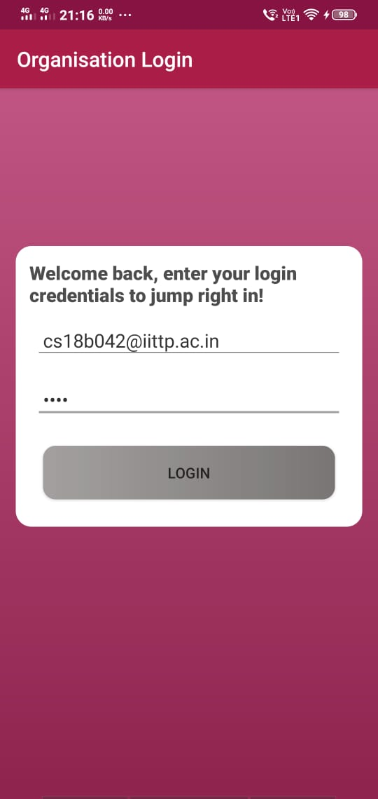  
Enter valid credentials to login.  

4. Registration page option  
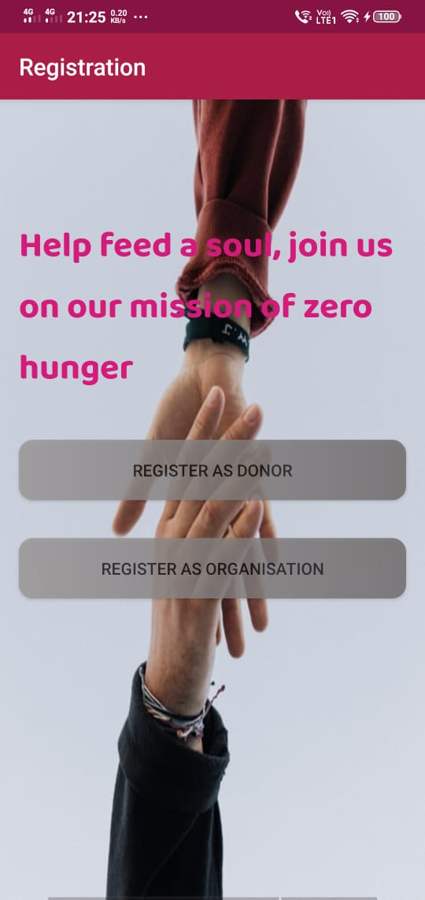  
Click on appropriate button for registration  

5. Registration page for Donor  
  
Fill in the details and tag location on map then click register.  

6. Home page for Donor  
  
scroll horizontally for more otpions and Click on appropriate button for making a donation  

7. Choose location to mark donation  
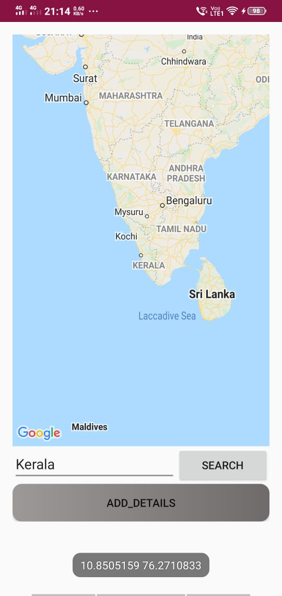  
search and mark the location to add donation then click on add details  

8. Fill Donation Details  
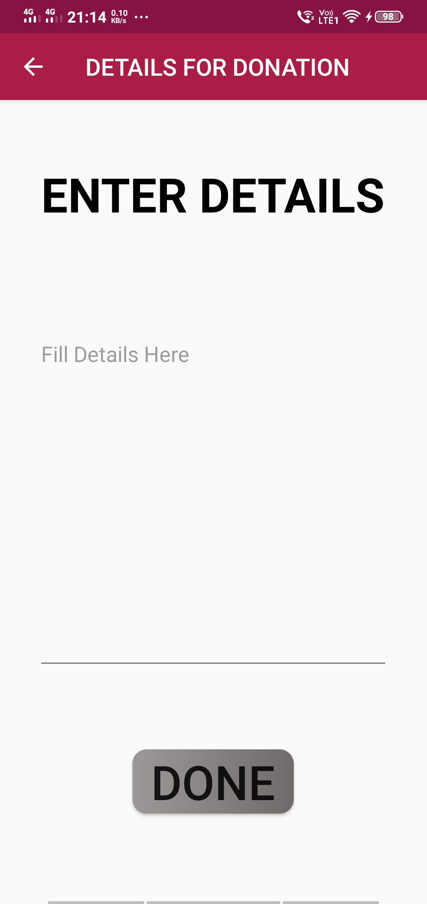  
Enter Donation details and click on done  

9. Discover page Donor 
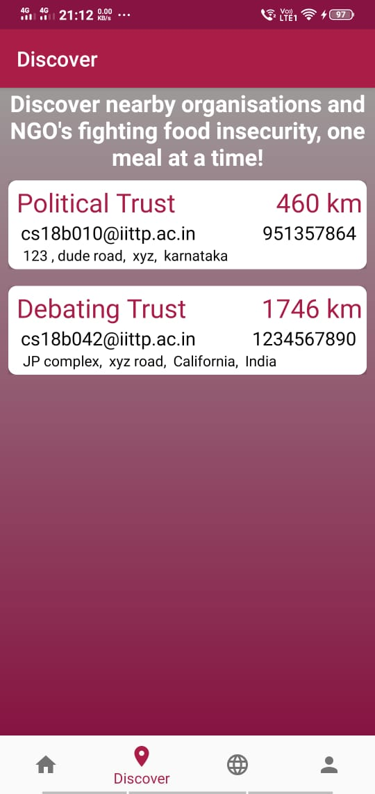  
You can see nearby NGO list here  

10. communtiy page Donor 
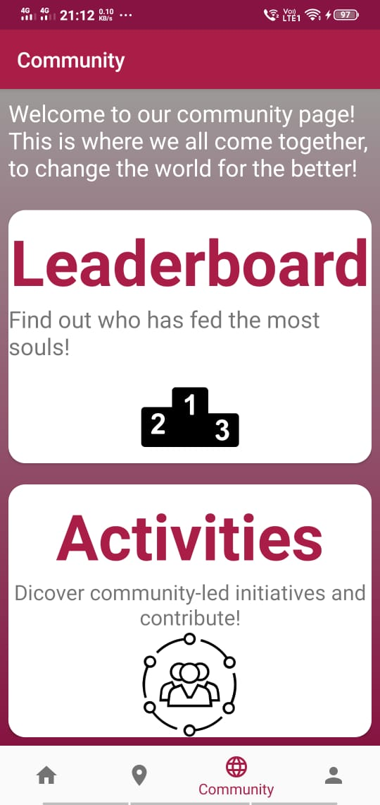  
You can see leaderboard and nearby events by clicking on specific card  

11. Profile page Donor 
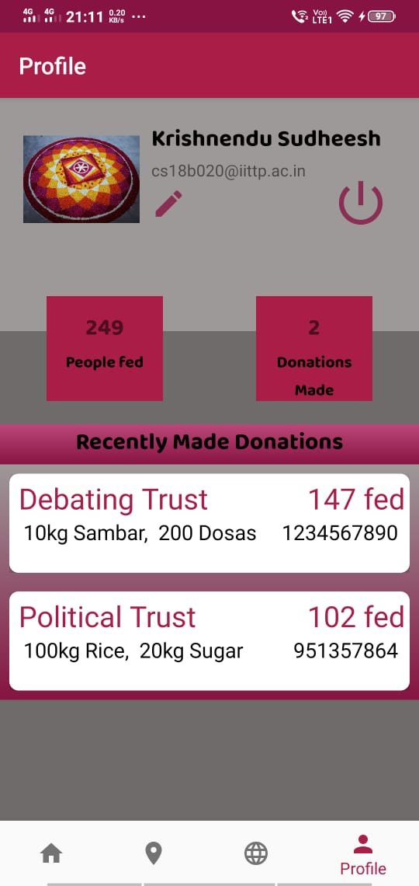  
You can see your details and other options here  

12. Home page for organisation  
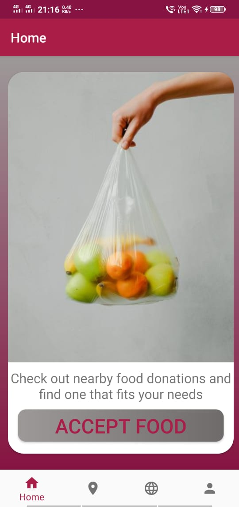  
scroll horizontally for more otpions and Click on appropriate button to check for donations  

13. Discover page for Organisation  
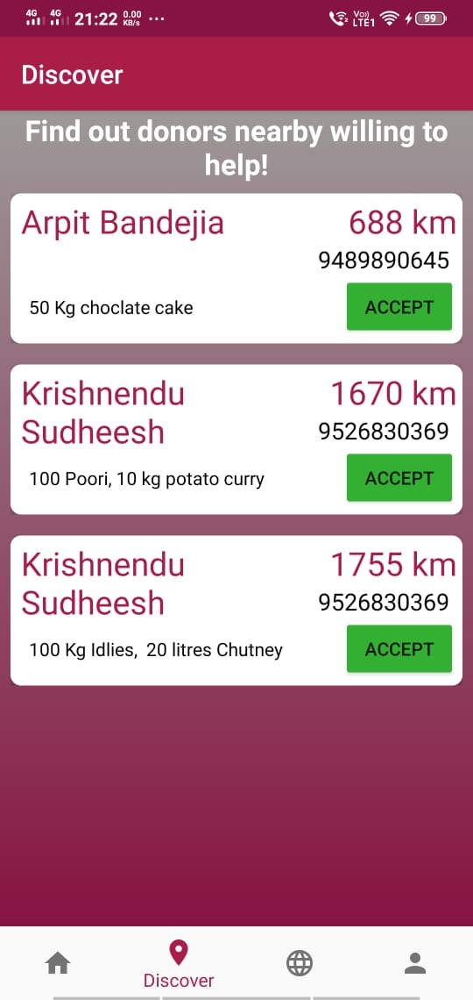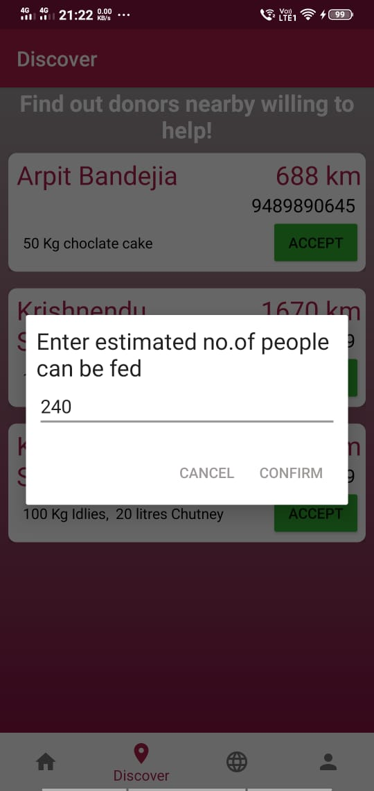  
You can see nearby Donars list here based on distance and accept food to confirm food Accepted  

14. communtiy page for organisation  
 
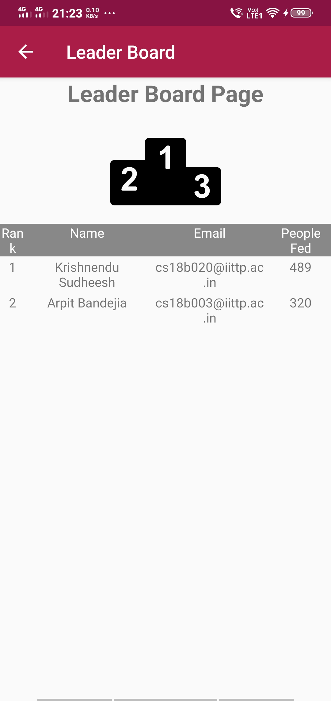  
You can see leaderboard and nearby events by clicking on specific card  

15. Profile page   
  
You can see your details and other options here ex by clicking on edit option you can edit details  
  

## App Functionality

### Donor

1. Registration
2. Login
3. Customise your profile
4. Discover organisations based on proximity
5. Post food donations
6. Upload profile picture
7. Leaderboard : Donations

### Organisation

1. Registration
2. Login
3. Custom profile
4. Discover food donations based on proximity
5. Accept donations
6. Upload profile picture
8. Leaderboard
    

## FAQ's

1. Which IP-address you are talking about?  
The IP-address depends on your choice of device, which you use to run the app as the server is not yet deployed on internet you have to locally create the server and connect your device on it. If you are using the system in-built emulator use the locahost ip of your machine, in case you are using a external device first of all ensure that both the mobile and your machine are connected to the same main network then provide the ip address of your network. 

2. How to check the IP-address of the main network?  
Use *ifconfig* command in your terminal/command prompt.

3. How to check that both are on the same network?  
For checking purposes of that, we have created a **\<IP-address\>:8000/test** route, if you are able to open the link in your mobile browser, voilà you are connected!

## Authors of the Project :

- **Arpit Bandejiya** (CS18B003)
- **Dinkar** (CS18B010)
- **Krishnendu Sudheesh** (CS18B020)
- **Shreyansh Mehra** (CS18B042)
